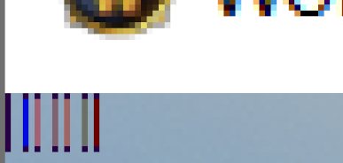
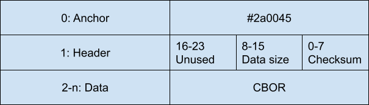

### LibSerpix
A pure-lua addon allowing realtime transmission of data out of the World of Warcraft client by serializing data as pixels and displaying it on the screen. Sibling program to https://github.com/alex-berliner/libserpix_rs which can parse this externally.



### Download

### Usage
1. Copy LibSerpix to your project's libraries folder
2. Include `LibSerpix\LibSerpix.xml` in your .toc
3. Use `LibSerpix = LibStub("LibSerpix-0.1")` or equivalent to get a handle to the library
4. Decide a namespace for your addon. The addon is single user right now but if I ever figure out how to accept data from multiple users this will be important :)
5. Create a table containing your message.
```
local data = {}
data["my_message"] = "message contents"
```
6. Send your message. LibSerpix will automatically transmit it over the screen!
```
LibSerpix.add_data("namespace", data)
```
7. Capture your message with an external program. A Rust library has been created for creating programs that can perform this at https://github.com/alex-berliner/libserpix_rs. It also contains an example application that outputs message contents to the console as JSON.
### Spec
LibSerpix transmits data by drawing a series of pixel columns to the top-left of the screen. LibSerpix expects that an external program is continuously reading the screen to process messages. It is up to the external screen reader to ensure that each frame of pixels generated by LibSerpix is captured, though provisions are made to make this more likely. The communication is not bidirectional; there is no mechanism for the realtime transmission of data back into the WoW client.

A WoW pixel has 4 channels: RGBA, each storing 1 byte. We must set the alpha channel to 0xFF because setting it to anything else would compromise the perceived value of the other channels, so we're left with being able to encode 3 bytes of data per pixel to RGB. Using this encoding, we can draw arbitary byte data to the screen as a series of pixels.

LibSerpix takes some liberties with the size of its drawn output. One might expect that the drawn output would be a 1 pixel high, n pixel long row of pixels. In reality, it draws 1 pixel wide columns of pixels and draws them spaced apart with 1 pixel. To explain:

1. WoW may sometimes draw the pixel rows 2 pixels wide instead of 1. If the pixels had no spaces in between then pixels would often get overlapped and screw up transmission of the whole frame.
2. When processing the screen capture, the pixels are sometimes caught between 2 states. Using columns of pixels instead of 1x1's gives a higher probability that the correct pixel will be captured. For each column, the pixel with the highest occurrence should be considered the real one.

## Frame Format


The first column is always the anchor (#2a0045): its purpose is to allow screen reader programs to reliably find the column array. This is especially important when the game is in windowed mode.

The second column is the header. It only contains enough information to allow the program to decode the data section. The size is the size of the Data section in bytes. The checksum is a basic 8-bit checksum over the Data section (sum of the Data section modulo 256).

The remaining bytes are the Data, which is a single CBOR message. This can be of any size though the library allocates 512 pixels by default (modify `PAYLOAD_BYTES` to increase).

## Columns
Each column starts and ends with the anchor color (#2a0045) as a hint to the screen reader as to which columns of the screenshot contain pixel data. By default columns are 8 pixels high; the pixel data takes up 6 pixels and the anchor takes up 2 at the top and bottom. The recommended way to search for columns containing pixel data is to:

1. Find the anchor column containing all #2a0045 pixels by scanning from left to right in the screen capture
2. Look for the header column by looking for the next column that has the anchor color at the top and bottom. Parse the header column (next after anchor) to determine how many pixels are in the Data segment
3. Look for the remaining header-indicated number of pixels using the same scanning method as in (2)
